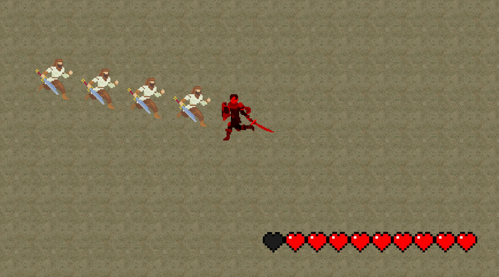

#IMPORTANT NOTE: THIS PROJECT IS UNFINISHED AND I'M NOT PLANNING TO FINISH IT, BUGS MAY APPEAR.

# Gladiator: Last Stand

  <strong>An arena-based action game developed with Unity and C#.</strong> 
  Survive relentless enemy waves, master melee combat, and defeat powerful bosses to become the last gladiator standing.

  
  
  

---

## Overview

**Gladiator: Last Stand** is a third-person arena combat game where the player must survive increasingly difficult enemy waves using timing, positioning, and defensive mechanics.

The game combines fast-paced melee combat with wave progression and boss encounters, encouraging players to balance aggression with strategy.

---

## Features

* ⚔️ Fast-paced melee combat
* 🛡️ Blocking system for defensive gameplay
* 💥 Push mechanic for crowd control
* 👹 Progressive enemy waves
* 📖 Story Mode
* 🎮 Smooth third-person controls

---

## Screenshots

  
  
  
  

---

## Controls

| Input                  | Action         |
| ---------------------- | -------------- |
| **W A S D**            | Move           |
| **Mouse**              | Control camera |
| **F**                  | Attack         |
| **G**                  | Block          |
| **R**                  | Push           |
| **ESC**                | Pause          |

---

## Installation

<b>Windows</b>

<a href=https://github.com/Ahmet-Can-Urhan/Gladiator-Last_Stand/releases/download/WINDOWS/Gladiator.-.Last.Stand.WINDOWS.zip>Download</a>
1. Download the latest release from the **Releases** section or the link above.
2. Extract the ZIP archive.
3. Launch `Gladiator Last Stand.exe`.
4. Enjoy the game.

<b>Linux</b> 

<a href="https://github.com/Ahmet-Can-Urhan/Gladiator-Last_Stand/releases/download/LINUX/Gladiator.-.Last.Stand.Linux.zip">Download</a>
1. Download the Linux release from the **Releases** section or the link above.
2. Extract the archive.
3. Open a terminal inside the extracted folder.
4. Make the executable runnable:
5. chmod +x "Gladiator Last Stand.x86_64"
6. Launch the game:
./Gladiator\ Last\ Stand.x86_64

Alternatively, you can make the file executable through your file manager and launch it by double-clicking.

<b>MacOS</b>

<a href="https://github.com/Ahmet-Can-Urhan/Gladiator-Last_Stand/releases/download/MACOS/Gladiator.-.Last.Stand.MacOS.app.zip">Download</a>
1. Download the macOS release from the **Releases** section or the link above.
2. Extract the archive.
3. Move Gladiator Last Stand.app to your Applications folder (optional).
4. Open the application.

If macOS prevents the game from opening because it was downloaded from the Internet:

Open System Settings → Privacy & Security.
Scroll to the Security section.
Click Open Anyway next to Gladiator Last Stand.
Confirm by clicking Open.

You only need to do this the first time you launch the game.

---

## Built With

* Unity
* C#
* Visual Studio

---

## What I Learned

Developing **Gladiator: Last Stand** strengthened my understanding of:

* Object-Oriented Programming
* Unity's component-based architecture
* Player movement and combat systems
* Enemy AI and wave management
* Collision detection and physics
* Scene management
* Animation integration
* Game balancing and playtesting
* Version control with Git and GitHub

## License

This project is available under the MIT License.

---

## Author

**Ahmet Can Urhan**

Computer Engineering Student

GitHub: https://github.com/Ahmet-Can-Urhan
